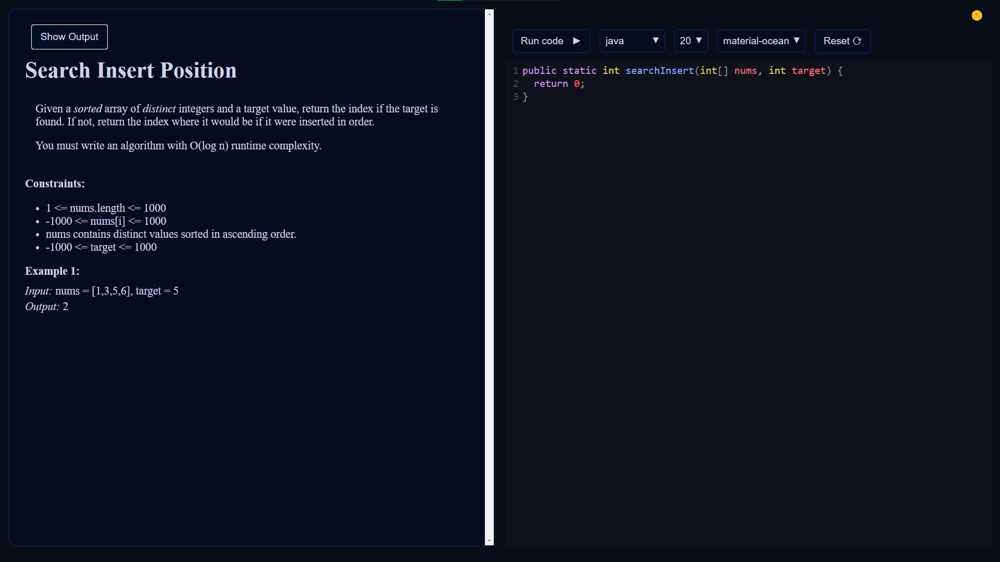
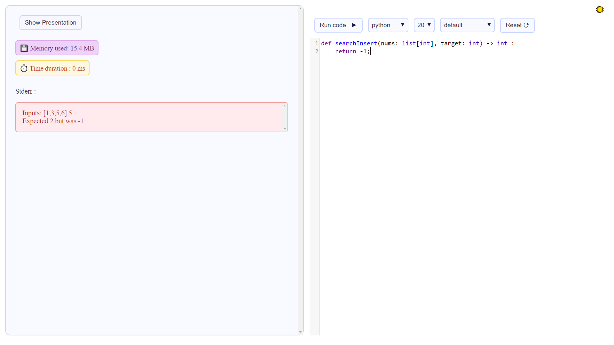
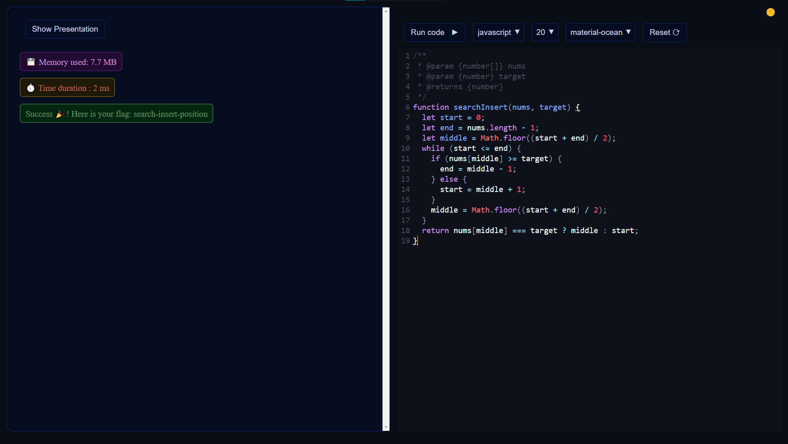

# Rezalgo

This is a project meant to be used as the algorithm and data structure part of a CTF.
It was inspired by the platform [LeetCode](https://leetcode.com).

</img>
</img>
</img>

Rezalgo lets you run code in [Podman](https://podman.io/) containers using its [API](https://docs.podman.io/en/latest/_static/api.html). Podman was selected because of its easy rootless setup. If you prefer to use Docker, you just need to change the API calls and the images used for the languages.

## Supported Languages

There are three supported languages for the moment: 
- Java
- Javascript
- Python

## How to use it

To run Rezalgo, you need:
- node version >= 14
- podman version 3

Once you cloned the repo, install the dependencies with `npm install` and build the project with `npm run build`.

### Development
In development mode, you need to specifiy the following environment variables:
- `SOCKET_PATH` \<string> Path of the socket to make the unix socket request
- `CONTAINER_API_VERSION` \<string> Version of the api in the request

Then start the server with `npm start`

### Production
In production mode, you need to specifiy the following environment variables:
- `NODE_ENV = production`
- `HOST` \<string> Host IP 
- `SOCKET_PATH` \<string> Path of the socket to make the unix socket request
- `CONTAINER_API_VERSION` \<string> Version of the api in the request

The application to run in production is contained in the `dist` folder. Send this folder on the production server, install the production dependencies with `npm install --production` and start the server with `node server.js`

Here are all the environment variables that you can defined, which are validated at the start of the application: [src/schemas/envVariables.ts](src/schemas/envVariables.ts)
## Adding a new challenge

It is fairly easy to add a new challenge. You can run the command `npm run add:challenge`, give the name of the challenge and it will generate for you the json skeleton for your challenge. Or you can copy paste an already existing challenge and change the necessary parameters.

You have complete autocompletion and validation of your json thanks to the JSON Schema [challenges.schema.json](challenges.schema.json), linked at the top of the challenge json file.

For each json file in the folder `challenges`, Rezalgo will generate a route, the helpers (the starter code visible on the page) and the tests.

Basically, if all you want is to add challenges, you will never need to touch the code.

## Adding a new language

You might want to add a new language, because the current supported languages are not enough for you. For that, run the command `npm run add:language`, answer the following questions and it will generate one new file `<fileExtension>Template.ts` in the folder `src/languagesMap` and edit the current file `src/schemas/languages.ts`.

The template file will be used to generate the helpers and the tests validation, mapping every logical blocks to the corresponding ones in the language.

The schema file will be used to validate HTTP requests and to run the appropriate language in a container.

Once you are done with the template, you just have to build the application and for all your challenges, the new language will be supported.
